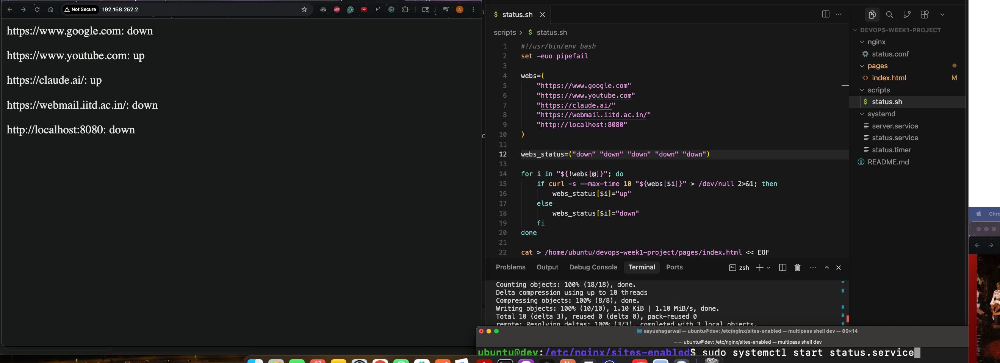
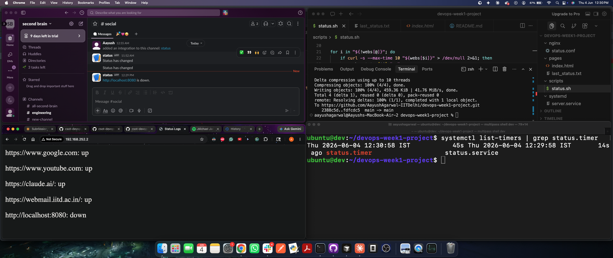

# devops-week1-project

A self-hosted status page that monitors services every minute and serves a live HTML page via nginx.

## Services monitored

- https://www.google.com
- https://www.youtube.com
- https://claude.ai/
- https://webmail.iitd.ac.in/
- http://localhost:8080

## Setup (Ubuntu VM)

We have set up such that repo is mounted to `~/devops-week1-project`.

```bash
# Copy systemd units
sudo cp systemd/server.service /etc/systemd/system/
sudo cp systemd/status.service /etc/systemd/system/
sudo cp systemd/status.timer /etc/systemd/system/

# Reload and start
sudo systemctl daemon-reload
sudo systemctl enable --now server.service
sudo systemctl enable --now status.timer

# Run status check once immediately
sudo systemctl start status.service

# Set up nginx
sudo cp nginx/status.conf /etc/nginx/sites-enabled/
sudo systemctl restart nginx
```

## Verify

```bash
curl http://localhost:8000        # Python server
curl http://localhost             # nginx proxy
journalctl -u status.service      # check logs
```

To view the page on your browswer first find your VM's IP:

```bash
multipass info dev | grep IPv4
```
Then open in your browser: http://your-vm-ip
Note: Since we have set up an nginx proxy, we dont need to specify port.




## Slack Webhook (Bonus)

To set up Slack Webhook, install a Slack app and get its webhook URL.
Store in an .env file (like .env.example)
Reload services:

```bash
sudo systemctl daemon-reload
sudo systemctl restart status.service
```

